# MCP Server Service - Tools 추출 시퀀스 다이어그램

```mermaid
sequenceDiagram
    participant Client as 클라이언트
    participant MCPService as MCPServerService
    participant GitHub as GitHub API
    participant MCPFiles as MCP 표준 파일들
    participant WebScraping as 웹 스크래핑
    participant DefaultTools as 기본 Tools

    Client->>MCPService: read_mcp_server_tool_list(github_link)
    
    Note over MCPService: 1단계: 실제 MCP 서버와 통신
    MCPService->>MCPService: _extract_tools_via_mcp_protocol()
    MCPService->>MCPService: _get_github_repo_info()
    MCPService->>MCPService: _clone_repository()
    MCPService->>MCPService: _run_mcp_server()
    
    alt Node.js 프로젝트
        MCPService->>MCPService: _run_node_mcp_server()
        MCPService->>MCPService: npm install
        MCPService->>MCPService: npm run start
    else Python 프로젝트
        MCPService->>MCPService: _run_python_mcp_server()
        MCPService->>MCPService: python -m venv
        MCPService->>MCPService: pip install -r requirements.txt
        MCPService->>MCPService: python main.py
    else Rust 프로젝트
        MCPService->>MCPService: _run_rust_mcp_server()
        MCPService->>MCPService: cargo build
        MCPService->>MCPService: cargo run
    end
    
    MCPService->>MCPService: _call_mcp_protocol_tools()
    
    loop 포트 시도 (3000, 8080, 8000, 5000, 4000)
        MCPService->>MCPService: HTTP POST /mcp
        alt 성공
            MCPService->>MCPService: _parse_mcp_protocol_response()
            MCPService-->>Client: tools 반환
        else 실패
            MCPService->>MCPService: HTTP POST /api/mcp
            alt 성공
                MCPService->>MCPService: _parse_mcp_protocol_response()
                MCPService-->>Client: tools 반환
            end
        end
    end
    
    alt HTTP 실패
        MCPService->>MCPService: _call_mcp_stdio_protocol()
        MCPService->>MCPService: JSON-RPC 메시지 전송
        MCPService->>MCPService: 응답 파싱
        MCPService-->>Client: tools 반환
    end
    
    MCPService->>MCPService: _stop_mcp_server()
    MCPService->>MCPService: _cleanup_temp_dir()
    
    alt MCP 서버 통신 실패
        Note over MCPService: 2단계: MCP 표준 파일에서 추출
        MCPService->>MCPService: _extract_tools_from_mcp_standard()
        MCPService->>GitHub: GitHub API 호출
        GitHub-->>MCPService: 저장소 파일 목록
        
        MCPService->>MCPFiles: MCP 표준 파일 검색
        Note over MCPFiles: .mcp.json, package.json, pyproject.toml, README.md
        
        loop 각 MCP 파일에 대해
            MCPService->>GitHub: 파일 내용 요청
            GitHub-->>MCPService: 파일 내용
            MCPService->>MCPService: _parse_mcp_standard_tools()
            
            alt JSON 파일
                MCPService->>MCPService: _parse_mcp_json_tools()
            else Markdown 파일
                MCPService->>MCPService: _parse_mcp_markdown_tools()
            else 텍스트 파일
                MCPService->>MCPService: _parse_mcp_text_tools()
            end
        end
        
        MCPService-->>Client: tools 반환
    end
    
    alt MCP 표준 파일 추출 실패
        Note over MCPService: 3단계: GitHub API 사용
        MCPService->>MCPService: _extract_tools_via_api()
        MCPService->>GitHub: GitHub API 호출 (토큰 필요)
        GitHub-->>MCPService: 저장소 정보
        MCPService->>MCPService: _extract_tools_from_content()
        MCPService-->>Client: tools 반환
    end
    
    alt GitHub API 실패
        Note over MCPService: 4단계: 웹 스크래핑
        MCPService->>MCPService: _extract_tools_via_scraping()
        MCPService->>WebScraping: GitHub 페이지 스크래핑
        WebScraping-->>MCPService: HTML 내용
        MCPService->>MCPService: _extract_tools_from_text()
        MCPService-->>Client: tools 반환
    end
    
    alt 모든 방법 실패
        Note over MCPService: 5단계: 기본 Tools 반환
        MCPService->>MCPService: _get_default_mcp_tools()
        MCPService->>DefaultTools: 저장소 이름 기반 추정
        DefaultTools-->>MCPService: 기본 tools 목록
        MCPService-->>Client: 기본 tools 반환
    end
```

## 시퀀스 다이어그램 설명

### **1단계: 실제 MCP 서버와 통신 (가장 정확)**
1. GitHub 저장소 클론
2. 프로젝트 타입 감지 (Node.js/Python/Rust)
3. 의존성 설치 및 서버 실행
4. MCP 프로토콜을 통한 tools 요청
5. JSON-RPC 응답 파싱

### **2단계: MCP 표준 파일에서 추출**
1. GitHub API로 저장소 파일 목록 가져오기
2. MCP 표준 파일 검색 (.mcp.json, package.json 등)
3. 각 파일에서 tools 정보 파싱
4. JSON/Markdown/텍스트 형식별 파싱

### **3단계: GitHub API 사용**
1. GitHub Personal Access Token 사용
2. 저장소 파일 내용 가져오기
3. 파일 내용에서 tools 추출

### **4단계: 웹 스크래핑**
1. GitHub 페이지 직접 스크래핑
2. README.md 및 기타 파일 내용 추출
3. 텍스트에서 tools 정보 파싱

### **5단계: 기본 Tools 반환**
1. 저장소 이름 기반 추정
2. 파일시스템/Git/HTTP/Ollama 등 타입별 기본 tools

### **폴백 시스템**
- 각 단계가 실패하면 다음 단계로 진행
- 가장 정확한 방법부터 시도
- 최후 수단으로 기본 tools 반환 